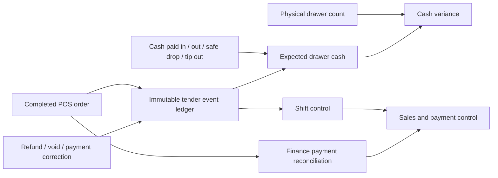

# Sales, Payments, and Cash Control — Module 2

Date: 2026-07-31
Status: implemented and verified; production deployment evidence is recorded in `COMPLETED_WORK.md`

## Purpose and users

This module gives the owner one control surface for sales and payment reconciliation, while giving supervisors and cashiers safe order, refund, shift, drawer, and closeout workflows.

| User | Primary work | Authoritative screen |
|---|---|---|
| Owner | Compare net sales with payment tenders, inspect exceptions and branch performance | `/sales` |
| Supervisor | Review orders, approve exceptions, inspect and close shifts | `/pos/:branchId/orders`, `/pos/:branchId/sessions`, `/pos/:branchId/end-of-day` |
| Cashier/barista | Capture payment, find orders, issue permitted refunds, count the drawer | POS terminal and order/closeout screens |

All reporting periods use the NOCH business day: 05:00 to 05:00 in `Africa/Tripoli`.

## Workflow and source map

Authoritative sources:

- Order-state sales and payment reconciliation: `finance_payment_reconciliation`.
- Tender movement at the time it occurred: immutable `pos_tender_events`.
- Expected drawer cash: opening cash plus cash tender events plus cash movements.
- Counted drawer cash: an explicitly recorded physical count; a missing count remains `null`, never zero.
- Shift control: `pos_shift_control`.
- Owner sales control: `pos_sales_control_summary`.
- Refund, void, payment switch, and shift close mutations: database RPCs that lock and validate the affected records.

The mutable totals retained on `pos_shifts` are compatibility counters, not the financial source of truth. Their differences from the event-derived totals are exposed for review.

## Business definitions

- **Completed sales:** gross value of completed orders in the selected business-day range.
- **Linked refunds:** refund value linked to those orders, regardless of when the refund was processed.
- **Net sales:** completed sales minus linked refunds.
- **Gross tender collected:** cash, card, Presto, and other tender originally captured on completed orders.
- **Tender movement:** signed payment activity processed during the selected period. Sales are positive; refunds and void reversals are negative.
- **Payment reconciliation variance:** gross order tender minus completed sales. It must be zero or explicitly reported.
- **Timing variance:** order-state net sales minus period tender movement. A non-zero amount can be valid when a refund for an earlier order is processed in the selected period.
- **Expected drawer cash:** opening cash + cash collected − cash returned + paid in − paid out − safe drops − tip outs.
- **Cash variance:** counted drawer cash minus expected drawer cash.
- **Settlement:** external evidence that a processor or bank paid NOCH. A POS card record is not settlement evidence.

## Feature classification

### Essential

- Payment capture and split-tender decomposition.
- Order evidence, reprint, tender-specific refunds, voids, and controlled payment corrections.
- Open and close shifts, drawer counts, cash movements, and cash variance.
- Branch and consolidated sales/payment reconciliation.
- Visible completeness, reconstruction, timing, and settlement status.

### Consolidate

- `/sales` is the single owner sales and payment-control view.
- `/pos/:branchId/sessions` is the shift and drawer-control view.
- Existing Finance P&L remains the authority for revenue/profit; Sales does not create a competing profit calculation.
- The former branch report route now redirects to `/sales`.

### Archive or hide

- The legacy branch POS report is inactive but retained in source for rollback.
- Its demand forecast is hidden until the Inventory module establishes a supported forecasting definition.

### Remove

- Removed the conflicting post-midnight exclusion toggle.
- Removed a dead duplicate date-range control. The shared business-range picker is authoritative.
- Removed the assumption that every refund leaves the cash drawer.

No business records or historical screens were permanently deleted.

## Implemented controls

- Added an additive, RLS-protected `pos_tender_events` ledger with idempotent source references and recorded/reconstructed source quality.
- Reconstructed historical sale/refund/void tender legs. Split orders are represented as cash and card legs, not a third tender.
- Refunds record the actual return tender and processing shift. Cash refunds require an open drawer; only the cash leg changes expected cash.
- Voids and payment changes are rejected for closed shifts and operate only on the remaining unrefunded value.
- Shift close recomputes the drawer from authoritative events while preserving an omitted physical count as missing.
- Open-shift compatibility counters are snapshotted before repair. Closed historical counters are preserved and their differences are visible.
- Sales and shift screens show unavailable data rather than silently substituting zero.
- Critical owner, refund, shift, and closeout controls have explicit English and Arabic copy and responsive layouts.

## Validation evidence

The full migration was executed against the production schema inside a transaction and rolled back before live application. The rollback validation produced:

- 10,591 tender events.
- 169 reconstructed historical tender legs in the full ledger; 11 fall in the
  tested 30-day owner-reporting period.
- 0 untracked orders.
- 0.000 LYD order payment variance.
- 0.000 LYD tender-event variance.
- 0.000 LYD timing variance for the tested 30-day period.
- 0 shift payment gaps.
- 17 preserved differences in historical closed-shift expected-cash counters.
- 0 shift sales-counter gaps.
- 2 open shifts included in the safe repair path.

Automated verification:

- Seven focused sales/cash-control tests passed.
- Targeted ESLint passed.
- POS production build passed.
- `git diff --check` passed.

## Rollback and preservation

The migration is additive. It keeps legacy RPC signatures as compatibility wrappers and does not delete orders, refunds, shifts, or cash movements. Before updating open-shift compatibility counters it stores their prior values in `pos_shift_control_repair_archive_20260731`. A rollback can restore those counters from the archive and remove the additive interfaces without altering the source business records.

## Remaining risks and backlog

1. Card settlement reconciliation is unavailable because NOCH has no card processor or bank statement feed. Add statement import/matching before calling card payments settled.
2. Presto has a recorded collected flag and accounting evidence, but no independent statement import. Add a Presto settlement feed and exception queue.
3. Historical refund/void legs are reconstructed from order proportions because the original return tender was not captured. There are 169 in the full ledger and 11 in the tested 30-day reporting period; they remain visibly marked rather than presented as recorded fact.
4. Seventeen closed shifts contain differences between historical stored expected cash and the event-derived result. They are preserved for audit and were not silently rewritten.
5. Demand forecasting belongs to Module 3 after inventory movement and waste definitions are authoritative.

## Definition-of-done assessment

- Sales and payment totals reconcile exactly or expose an explainable timing variance.
- Refunds, voids, and payment corrections are traceable by tender and actor.
- Missing counts, untracked orders, reconstructed history, and unsupported settlement are visible.
- The owner can see business-day sales, tender movement, reconciliation, and urgent exceptions on one screen.
- Detailed order and shift evidence is available without cluttering the owner view.
- English/Arabic terminology and mobile layouts are supported.
- Records are preserved and the material database change has a tested rollback path.
